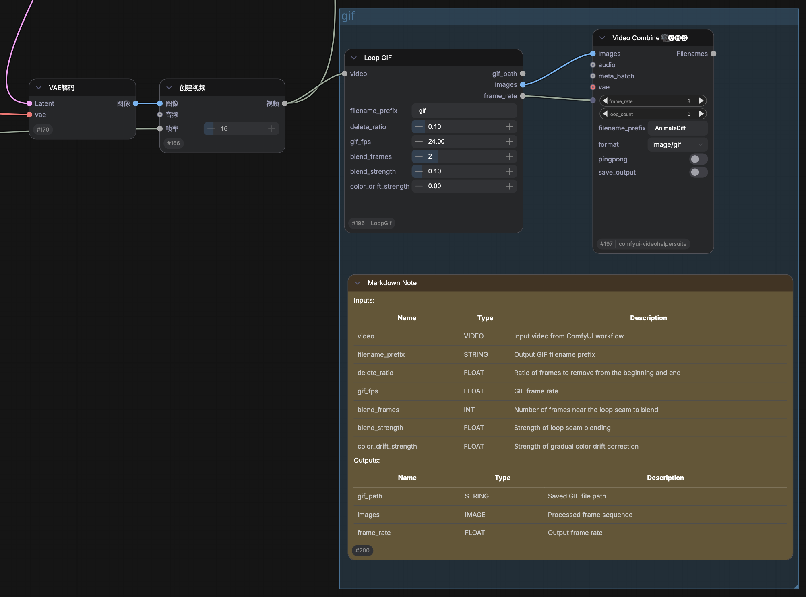

# ComfyUI-LoopGif

A simple ComfyUI custom node for creating looping GIFs from VIDEO inputs.

This node is mainly designed for short AI-generated videos, especially image-to-video workflows where the first and last frames are expected to be similar. It can trim frames from the beginning and end, apply mild loop blending, and optionally compensate for gradual color drift before exporting a GIF.

When `delete_ratio` is set to `0`, the node can also be used as a normal GIF exporter without trimming frames.

## Features

- Convert ComfyUI `VIDEO` input to looping GIF
- Supports video file based inputs
- Supports in-memory video components, such as videos created inside a workflow
- Output GIF path as `STRING`
- Output processed frames as `IMAGE`
- Output GIF frame rate as `FLOAT`
- Optional head/tail frame trimming
- Optional loop seam blending
- Optional gradual color drift correction
- Can also be used to create regular GIFs when `delete_ratio` is set to `0`
- Automatically cleans temporary working files after execution

## Installation

### Install with ComfyUI Manager / Comfy Registry

```bash
comfy node install comfyui-loopgif
```

Or search for ComfyUI-LoopGif in ComfyUI Manager.

### Clone this repository into your ComfyUI `custom_nodes` folder:

```bash
cd ComfyUI/custom_nodes
git clone https://github.com/HM1579/ComfyUI-LoopGif.git
```

Then install dependencies into your ComfyUI Python environment.

If you are using a normal ComfyUI installation with a virtual environment, activate it first:

```bash
cd ComfyUI
source .venv/bin/activate
cd custom_nodes/ComfyUI-LoopGif
python -m pip install -r requirements.txt
```

If you are using ComfyUI Desktop or another packaged ComfyUI version, use the Python executable that ComfyUI actually runs with. You can find it in the ComfyUI startup log, for example:

```text
** Python executable: /path/to/ComfyUI/.venv/bin/python
```

Then run:

```bash
/path/to/ComfyUI/.venv/bin/python -m pip install -r requirements.txt
```

Restart ComfyUI after installation.

## Requirements

This node requires:

- numpy
- Pillow
- imageio-ffmpeg

The node will try to use system `ffmpeg` first. If system `ffmpeg` is not found, it will fall back to `imageio-ffmpeg`.

On macOS, the node also checks common Homebrew paths:

```text
/opt/homebrew/bin/ffmpeg
/usr/local/bin/ffmpeg
```

## Example Workflow

A minimal example workflow is included in the `examples` folder.



Files:

- [`examples/loopgif_example_workflow.json`](examples/loopgif_example_workflow.json)
- [`examples/loopgif_example_workflow.png`](examples/loopgif_example_workflow.png)

The example shows how to connect a ComfyUI `VIDEO` input to the `Loop GIF` node and export a looping GIF.

You can also use the `Video Combine` node from `ComfyUI-VideoHelperSuite` as an in-workflow GIF preview window. Connect the `images` and `frame_rate` outputs from `Loop GIF` to `Video Combine`, set the output format to GIF, and disable saving if you only want to preview the result inside the workflow.

## Creating Better Seamless Loops

For seamless looping GIFs, it is recommended to use a first-frame / last-frame video workflow when generating the source video latent. In image-to-video workflows, the starting image and ending image should ideally be the same image.

The prompt should describe not only the motion or transformation, but also how the subject returns to the initial state. For example, instead of only describing an action, describe the action and its recovery process.

Because the return-to-start motion needs to occupy part of the available frame range, the action should not be too complex, especially for very short videos. If the motion is too ambitious, the video may not have enough frames to complete both the action and the return process, resulting in a less stable loop.

In short:

- Use the same image as both the first and last frame when possible
- Describe both the motion and the return process in the prompt
- Keep the motion simple for short videos
- Use `delete_ratio` to trim unstable or slow frames near the loop seam
- Set `delete_ratio` to `0` if you only want to export a regular GIF without loop trimming

## Node

### Loop GIF

Category:

```text
video/gif
```

Inputs:

| Name | Type | Description |
|---|---|---|
| video | VIDEO | Input video from ComfyUI workflow |
| filename_prefix | STRING | Output GIF filename prefix |
| delete_ratio | FLOAT | Ratio of frames to remove from the beginning and end |
| gif_fps | FLOAT | GIF frame rate |
| blend_frames | INT | Number of frames near the loop seam to blend |
| blend_strength | FLOAT | Strength of loop seam blending |
| color_drift_strength | FLOAT | Strength of gradual color drift correction |

Outputs:

| Name | Type | Description |
|---|---|---|
| gif_path | STRING | Saved GIF file path |
| images | IMAGE | Processed frame sequence |
| frame_rate | FLOAT | Output frame rate |

## Parameter Guide

### delete_ratio

Controls how many frames are removed from the beginning and end of the video.

This is usually the most important parameter for making a short video loop better.

Recommended range:

```text
0.05 - 0.15
```

Suggested default:

```text
0.10
```

If the loop has a long pause near the seam, increase this value slightly.  
If the loop feels too jumpy, reduce it slightly.

Set this value to `0` if you do not want to trim frames. In this mode, `Loop GIF` can be used as a regular GIF exporter.

### gif_fps

Controls the playback speed of the exported GIF.

Recommended values:

```text
18 - 24
```

Higher FPS may look smoother, but also produces larger GIF files.

### blend_frames

Controls how many frames near the loop seam are blended.

Recommended range:

```text
0 - 2
```

This is a minor helper parameter. It may reduce small seam flickers, but high values can cause ghosting or unnatural transitions.

### blend_strength

Controls the strength of the loop seam blending.

Recommended range:

```text
0.05 - 0.20
```

Suggested default:

```text
0.10
```

Too high values may introduce visible ghosting.

### color_drift_strength

Compensates for gradual color drift across the video.

This can help when the final frame has a different overall color tone from the first frame, causing a visible flash when the GIF loops.

Recommended range:

```text
0.0 - 1.5
```

Suggested default:

```text
0.0
```

This parameter is experimental. It may help in some cases, but it is not a universal fix.

## Notes

This node is designed as a lightweight practical tool rather than a complex video post-processing system.

For most workflows, the recommended tuning order is:

1. Adjust `delete_ratio`
2. Adjust `gif_fps`
3. Optionally enable small `blend_frames`
4. Optionally adjust `color_drift_strength` if there is visible color drift

In many cases, `delete_ratio` alone is enough.

For normal GIF export, set `delete_ratio` to `0`.

For in-workflow preview, you can connect the `images` and `frame_rate` outputs to `Video Combine` from `ComfyUI-VideoHelperSuite`.

## Temporary Files

The node creates a temporary hidden working folder during execution, such as:

```text
.output_name_work
```

This folder is automatically removed after execution, whether the process succeeds or fails.

## Limitations

- GIF output does not preserve audio
- Large videos may consume more memory when outputting processed frames as `IMAGE`
- Color drift correction is experimental
- Loop quality still depends heavily on the source video and prompt quality
- For seamless loops, the source video should already have a reasonable first-to-last-frame transition

## License

MIT License